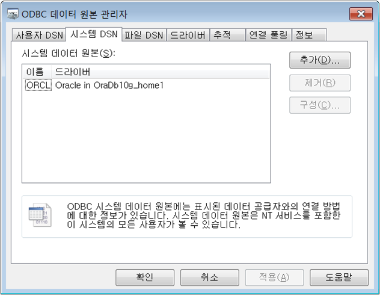

##1.기본 R 함수

###유용한 함수

- help(seq), print(c), typeof(z)
- a1 <- 1:5
- b1 <- 10:6
- paste(a1, b1, sep="&") # 붙이기

###작업디렉토리 설정
- getwd() 		#작업 위치 확인
- setwd("G:\\etc\\R")	#작업 위치 저장
- rm(list=ls(all=TRUE))                   #--- 작업 영역에 저장된 데이터 모두 삭제

###통계 함수
- data(iris)  
- head(iris)  # 1~6Row 까지 검색
- tail(iris)  # 마지막-6 Row 까지 검색
- names(iris) #  변수명 검색
- summary(iris)

- data <- iris$Sepal.Length
- mean(data)                              #--- 평균
- median(data)                            #--- 중앙값
- sd(data)                                #--- 표준편차
- var(data)                               #--- 분산
- quantile(data, 1/4)                     #--- 1사분위수
- quantile(data, 3/4)                     #--- 3사분위수
- max(data)                               #--- 최대값
- min(data)                               #--- 최소값
- range(data)   # 최소값 , 최대값
- IQR(data)   #--3사분위수 - 1사분위수

##2.ODBC를 이용한 Oracle 연결하기.
###1. ODBC 등록 
 

###2. R Package ODBC Download
- Url : http://cran.r-project.org/web/packages/RODBC/index.html

###3. R Stduio 를 통하여 ODBC 설정 코드 입력
- install.library(“RODBC”)
- library(RODBC)
- channel <- odbcConnect("orcl", uid="scott", pwd="tiger", believeNRows=FALSE)
- odbcGetInfo(channel)
- Tables <- sqlTables(channel, schema="SCHEMA")
- dataframe <- sqlQuery(channel, "
 SELECT *
 FROM
 SCHEMA.EMP")

##3.리눅스 R설치 및 RStudio Server 설치
- R설치
http://www.jason-french.com/blog/2013/03/11/installing-r-in-linux/

### For El5 or CentOS 5
- su -c 'rpm -Uvh http://download.fedoraproject.org/pub/epel/5/i386/epel-release-5-4.noarch.rpm'
- sudo yum update
- sudo yum install R

### For El6 or CentOS 6(Root 로 설치, hadoop으로 설치하면 안되네ㅠ.ㅠ)
-33 su -c 'rpm -Uvh http://download.fedoraproject.org/pub/epel/6/i386/epel-release-6-8.noarch.rpm'
- sudo yum update
- sudo yum install R

- yum list R-\*

###RStudio 설치
- 32-bit Size: 16.3 MB MD5: f21b32cc0aa8836f5428d4881661d8ea
- $ wget http://download2.rstudio.org/rstudio-server-0.98.501-i686.rpm
- $ sudo yum install --nogpgcheck rstudio-server-0.98.501-i686.rpm
- 64-bit Size: 16.3 MB MD5: 8715e1ffcc6a727ea20368b6a467587d
- $ wget http://download2.rstudio.org/rstudio-server-0.98.501-x86_64.rpm
- $ sudo yum install --nogpgcheck rstudio-server-0.98.501-x86_64.rpm

- url : http://node201.hadoop.com:8787/
- http://pncco.iptime.org:8787/

## 4. 공공 데이터 사이트 
###국내
- 국가 DB 피디아 (http://lod.data.go.kr/)
- 국가 공유자원 포털 (https://www.data.go.kr/)
- 서울 열린 데이터 광장 (http://data.seoul.go.kr/index.jsp)
- TheDataHub (http://thedatahub.kr/) --> 서울대 의생명 지식공학 연구실에서 영국의 ckan을 기반으로 만든 오픈데이터 포털
- 실시간 수질 정보 (http://www.koreawqi.go.kr/) --> 2013년 1월 10부터 공개됨 (2013. 1. 14 업데이트)

###국외
- 빠른 외국 정부에서는 2008~9년부터 포털을 통해 공개하였고, 2011년이 되어서야 여러나라에서 공개하기 시작함.

- 영국 오픈소스 데이터포털 소프트웨어 ckan (http://ckan.org/)
- 미국 공공데이터 (https://explore.data.gov/)
- 미국 뉴욕시 공공데이터 (https://nycopendata.socrata.com/)
- 영국 공공데이터 (http://data.gov.uk/data)
- 호주 공공데이터 (http://data.gov.au/data/)
- 캐나라 공공데이터 (http://data-donnees.gc.ca/)
- 뉴질랜드 공공데이터 (http://data.govt.nz/)
- 노르웨어 공공데이터 (http://data.norge.no/)
- 그리스 지리정보 데이터 (http://geodata.gov.gr/)
- 러시아 공공데이터 (http://opengovdata.ru/)
- 모로코 공공데이터 (http://data.gov.ma/)
- 벨기에 공공데이터 (http://data.belgium.be/)
- 케냐 공공데이터 (https://opendata.go.ke/)
- 네덜란드 공공데이터 (http://data.overheid.nl/)
- 네덜란드 로테르담시 Open Data Store (http://www.rotterdamopendata.nl/web/guest/home)
- 칠레 공공데이터 (http://datos.gob.cl/)
- 이탈리아 공공데이터 (http://data.gov.it/)
- 스페인 공공데이터 (http://datos.gob.es/)
- 우루과이 공공데이터 (http://datos.gub.uy/)
- 프랑스 공공데이터 (http://data.gouv.fr/)
- 브라질 공공데이터 (http://beta.dados.gov.br/)
- 에스토니아 공공데이터 (http://www.opendata.ee/)
- 포루투갈 공공데이터 (http://www.dados.gov.pt/)
- 몰도바 공화국 공공데이터 (http://date.gov.md/)
- 인도 공공데이터 (http://data.gov.in/)
- 오스트리아 공공데이터 (http://data.gv.at/)
- 유럽연합 공공데이터 (http://open-data.europa.eu/)
- 세계은행 공공데이터 (http://data.worldbank.org/data-catalog)

- <참고 : http://en.wikipedia.org/wiki/Open_data>
